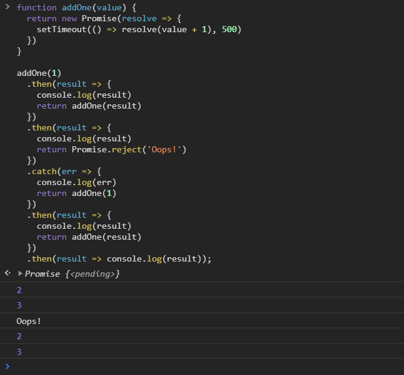

[`Programación con JavaScript`](../../Readme.md) > [`Sesión 04`](../Readme.md) > `Ejemplo 02`

---

## Ejemplo 2: Cadena de promesas

### Objetivo

Encadenar múltiples promesas

#### Requisitos

Crear un archivo `index.html` con la siguiente estructura:

```html
<html>
  <head>
    <meta charset="utf-8"/>
    <title>Ejemplo 2: Cadena de promesas</title>
  </head>
  <body>   
    <script type="text/javascript" src="./ejemplo-2.js"></script>
  </body>
</html>
```

Dentro de la misma carpeta creamos un archivo `ejemplo-2.js` que es donde
se trabajará este ejemplo. Finalmente abre el archivo `index.html`
en Chrome e inspecciona la consola para ver los resultados.

#### Desarrollo

Ya mencionamos anteriormente que el método `catch` registra un callback para ser ejecutado cuando una promesa es 
rechazada. Si esto sucede las promesas de los métodos `then` también son rechazadas. La ejecución se reanuda después
de un `catch`.

La siguiente función nos retorna un promesa que se resuelve con la suma del valor que recibe más uno después de medio 
segundo. Podemos encadenar múltiples `then` y seguir usando la misma función

```javascript
function addOne(value) {
  return new Promise(resolve => {
    setTimeout(() => resolve(value + 1), 500)
  })
}

addOne(1)
  .then(result => {
    console.log(result) // 2
    return addOne(result)
  })
  .then(result => console.log(result)) // 3;
```

Como ya mencionamos, una promesa rechazada sería atrapada por el método `catch`.

```javascript
function addOne(value) {
  return new Promise(resolve => {
    setTimeout(() => resolve(value + 1), 500)
  })
}

addOne(1)
  .then(result => {
    console.log(result)
    return addOne(result)
  })
  .then(result => {
    console.log(result)
    return Promise.reject('Oops!')
  })
  .catch(err => console.log(err)); // Oops!
```

Y podemos retomar la cadena de promesas después del `catch`.

```javascript
function addOne(value) {
  return new Promise(resolve => {
    setTimeout(() => resolve(value + 1), 500)
  })
}

addOne(1)
  .then(result => {
    console.log(result) // 2
    return addOne(result)
  })
  .then(result => {
    console.log(result) // 3
    return Promise.reject('Oops!')
  })
  .catch(err => {
    console.log(err) // Oops!
    return addOne(1)
  })
  .then(result => {
    console.log(result) // 2
    return addOne(result)
  })
  .then(result => console.log(result)); // 3
```


