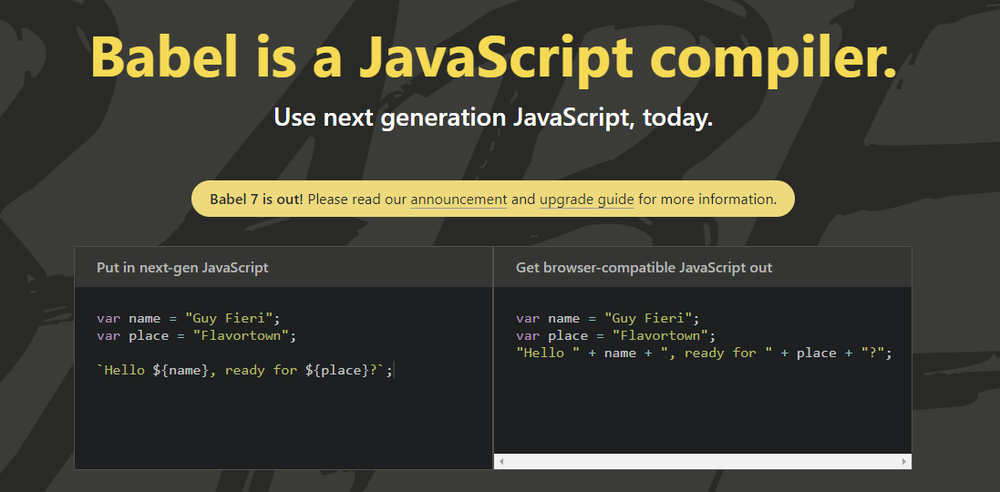

[`Programación con JavaScript`](../Readme.md) > `Sesión 07`

---

# Sesión 7: Babel

## Objetivos

Compilar las nuevas características de JavaScript en código compatible con todos los navegadores

---

## Tabla de Contenidos

- **[Babel](#babel)**

- **[Plugins](#plugins)**

- **[Presets](#presets)**

    - [Ejemplo 1: Instalación y configuración](./Ejemplo-01/Readme.md)
    
    - [Ejemplo 2: Webpack y babel](./Ejemplo-02/Readme.md)
    
    - [Reto 1: Repo finder](./Reto-01/Readme.md)
    
---

## Babel



[Babel](https://babeljs.io/) es usado principalmente para convertir código ES6+ en una versión compatible con 
navegadores y ambientes tanto actuales como anteriores.

```javascript
// Babel Input: ES6 arrow function
[1, 2, 3].map((n) => n + 1);

// Babel Output: ES5 equivalent
[1, 2, 3].map(function(n) {
  return n + 1;
});
```

Podemos empezar instalando dos librerias: `@babel/core` y `@babel/cli`. La primera es el _core_ o núcleo, aquí se
encuentra la principal funcionalidad de Babel. La segunda librería nos permite usar Babel desde la terminal. Ambas se
pueden instalar con npm.

```
npm install --save-dev @babel/core @babel/cli
```

Si cuentas con una versión de npm superior a 5.2 puedes ejecutar el siguiente comando para compilar el código con babel.

> `npm -v` para verificar la versión de npm en consola

```
npx babel src --out-dir dist
```

Gracias a `@babel/cli` el comando anterior funciona y lo que hace es tomar todos los archivos de JavaScript que encuentre
en la carpeta `src`, aplicar las transformaciones que hayamos especificado y colocar los archivos resultantes en la
carpeta `dist`. En este caso no hemos definido alguna transformación por lo que el código resultante será igual al que
se encuentra en `src`.

---

## Plugins

Las transformaciones de código que se mencionaron anteriormente se realizan a través de plugins. Cada plugin le dice a 
babel cómo transformar el código. Por ejemplo, el plugin `@babel/plugin-transform-arrow-functions` permite transformar
arrow functions.

```
npm install --save-dev @babel/plugin-transform-arrow-functions
npx babel src --out-dir dist --plugins=@babel/plugin-transform-arrow-functions
```

Con la opción `--plugins` definimos los plugins que queremos usar.

```javascript
// Babel Input: ES6 arrow function
[1, 2, 3].map((n) => n + 1);

// Babel Output: ES5 equivalent
[1, 2, 3].map(function(n) {
  return n + 1;
});
```

En esta ocasión el compilado en la carpeta `dist` habrá hecho la transformación del arrow function. Podemos usar
varios [plugins](https://babeljs.io/docs/en/plugins) para transformar distintos features de ES6+.

---

## Presets

En lugar de agregar todos los plugins que queremos implementar uno por uno podemos usar _presets_. Estos son conjuntos
ya preestablecidos de ciertos plugins. Por ejemplo, el preset `@babel/preset-env` contiene todos los plugins necesarios
para soportar las versiones modernas de JavaScript. La instalación y el uso es igual que los plugins.

```
npm install --save-dev @babel/preset-env
npx babel src --out-dir dist --presets=@babel/preset-env
```

Con la opción `--presets` definimos el preset que queremos usar.

```javascript
// Babel Input: ES6 arrow function
[1, 2, 3].map((n) => n + 1);

// Babel Output: ES5 equivalent
[1, 2, 3].map(function(n) {
  return n + 1;
});
```

Para el ejemplo anterior el resultado es el mismo. La diferencia está en que usando el plugin 
`@babel/plugin-transform-arrow-functions` babel solo va a transformar arrow functions, mientras que usando el preset
`@babel/preset-env` babel podrá transformar la mayoría de características que vienen con ES6+.

#### [Ejemplo 1: Instalación y configuración](./Ejemplo-01/Readme.md)

Babel es tan flexible que nos permite crear nuestros propios presets con los plugins que necesitemos e incluso otros 
presets.

Supongamos que el archivo de configuración que estamos usando es como el siguiente:

```json
{
  "presets": [
    "es2015",
    "react"
  ],
  "plugins": [
    "transform-flow-strip-types"
  ]
}
```

Ahora debemos crear un nuevo proyecto siguiendo la convención de nombres `babel-preset-*` y colocar dos archivos. El
primero es un nuevo `package.json` donde vamos a definir las dependencias del preset.

```json
{
  "name": "babel-preset-custom-preset",
  "version": "1.0.0",
  "author": "John Doe",
  "dependencies": {
    "babel-preset-es2015": "^6.3.13",
    "babel-preset-react": "^6.3.13",
    "babel-plugin-transform-flow-strip-types": "^6.3.15"
  }
}
```

El segundo archivo que necesitamos es un `index.js` donde vamos a exportar el contenido del archivo de configuración
reemplazando los strings del plugin/preset por `require`.

```javascript
module.exports = {
  presets: [
    require("babel-preset-es2015"),
    require("babel-preset-react")
  ],
  plugins: [
    require("babel-plugin-transform-flow-strip-types")
  ]
};
```

Después de publicarlo en npm se puede usar como cualquier otro preset.

#### [Ejemplo 2: Webpack y babel](./Ejemplo-02/Readme.md)

#### [Reto 1: Repo finder](./Reto-01/Readme.md)
